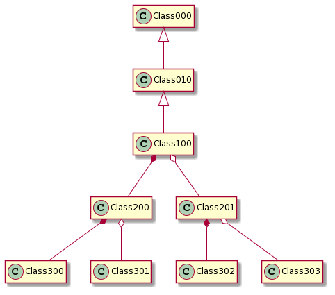

```{r setup, include=FALSE}
knitr::opts_chunk$set(echo = TRUE)

```


```{r init, include=FALSE}
#library(UMLR2)
source("testClasses.R")
testData="@startuml\n[*]-->STATE1\n@enduml\n"

source("../R/R6Messages.R")
source("../R/R6Config.R")
source("../R/R6UMLR2Base.R")

sapply(list.files("../R", "\\.R$", full.names = TRUE), source)
config = CONFIG$new(plantuml   = "c:/SDK/plantuml/plantuml.jar"
                    ,inputDir  = "uml"
                    ,outputDir = "img"
                    )

```


```{r}
print(cat("Inicio desde ", getwd()))
# umlr$addStyle("monochrome", TRUE)
# base = UMLShow$complete + UMLShow$subclasses + UMLShow$parents + UMLShow$classComplete
# umlr$plotClass(c10, base)
```


# Intro

El paquete provee una clase (**UMLR**) para generar definiciones UML de objetos R.
Actualmente es posible procesar:

- Clases R6
- Clases S4 

El proceso general consiste en crear un objeto **UMLR** y ejecutar el método uno de los siguientes métodos sobre 
una instancia de una clase o un vector de ellas:

- plot

# Parametros de control 

El nivel de detalle y la información a generar se gestiona a través de los siguientes parámetros:

- detail
- deep

## Nivel de información: _detail_

```{r, echo=FALSE}
detValues = data.frame(Nombre=c("basic", "simple","complete","superClasses","subClasses","classSimple","classComplete")
                       ,Valor=c(0,1,2,16,32,256,512)
                       ,Muestra = c( "Miembros publicos propios y heredados"
                                  ,"Miembros publicos propios"
                                  ,"Todos los miembros de la clase"
                                  ,"La clase de la que hereda (si existe)"
                                  ,"Las clases que usa (agregadas o compuestas)"
                                  ,"Igual que 'simple' pero aplicado a las superclases y subclases"
                                  ,"Igual que 'complete' pero aplicado a las superclases y subclases"
                                  )
                         
                       )

```

```{r, echo=FALSE}
knitr::kable(detValues)
```

## Profundidad de analisis: _deep_

Cuando tiene sentido; es decir, cuando se ha indicado que se muestren super o subclases, _deep_ indica en nivel de 
profundidad del análisis.

Ejemplo:

Supongamos la siguiente estructura de clases:

 

```{r, echo=FALSE}

umlr0 = UMLR$new(plantuml   = "c:/SDK/plantuml/plantuml.jar"
                    ,inputDir  = "uml"
                    ,outputDir = "img"
                    )
                    
# lstClasses = c(                    
#  RClass$new("Class000")                    
# ,RClass$new("Class010")
# ,RClass$new("Class100")
# ,RClass$new("Class200")
# ,RClass$new("Class201")
# ,RClass$new("Class300")
# ,RClass$new("Class301")
# ,RClass$new("Class302")
# ,RClass$new("Class303")
# )
# 
# umlr0$addClass(lstClasses)

umlr0$addRelation("Class000", "Class010", RelType$parent)
umlr0$addRelation("Class010", "Class100", RelType$parent)
umlr0$addRelation("Class100", "Class200", RelType$aggregation)
umlr0$addRelation("Class100", "Class201", RelType$composition)
umlr0$addRelation("Class200", "Class300", RelType$aggregation)
umlr0$addRelation("Class200", "Class301", RelType$composition)
umlr0$addRelation("Class201", "Class302", RelType$aggregation)
umlr0$addRelation("Class201", "Class303", RelType$composition)
umlr0$setMainClass("Class100")
umlr0$plot()

```

 umlr$plotClass(c(uml, umlr), UMLShow$basic)


simple


 umlr$plotClass(c(uml, umlr), UMLShow$simple)


con padres

base = UMLShow$complete + UMLShow$superClasses
 umlr$plotClass(c(uml, umlr), base)


### parámetro _deep_
completo


base = UMLShow$complete + UMLShow$superClasses + UMLShow$subClasses
umlr$plotClass(c(uml, umlr), base + UMLShow$classComplete, deep=10)


UMLShow$


Supongamos la siguiente clase sencilla

```{r, eval=TRUE}
Class00 = R6::R6Class("R6CLASS00",
 public = list(
    initialize = function(...) { }
   ,method00   = function()    { }
 )
 ,active  = list (
     var00 = function(value) { }
 )
 ,private = list (
      .var00    = NA
     ,.method00 = function(data) {}
 )
)
c00 = Class00$new()
```


umlrr = UMLR$new(plantuml   = "c:/SDK/plantuml/plantuml.jar"
                    ,inputDir  = "uml"
                    ,outputDir = "img"
                    )


  umlrr$addClass(c00)
  umlrr$plot()


#rc = uml$checkInstallation()


## monochrome
print("Antes")

# umlr$addStyle("monochrome", TRUE)

